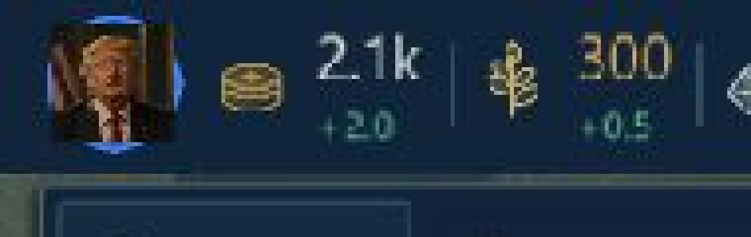

# DOMINION — סבב לקוח לא מרוצה, משחק ההורדה

תאריך עבודה: 8–9 באוקטובר 2026. גרסת Godot סופית: 0.9.81.

## תחום העבודה

מוצר המשחק הפעיל הוא משחק ה־PC עם מנוע Godot ב־native/godot. לפי הבהרת המשתמש ב־9 באוקטובר, המשך פיתוח, בדיקות ושחרורים מתייחסים למשחק זה. Steam הוא יעד עתידי להפצה. תוצאות גרסת הדפדפן אינן נכללות במניין או בתיקונים בדוח זה.

## מה נבדק באמת

שיחקתי דרך הממשק בקמפיין רוסיה, ברמת Easy על אי עם ארבע מדינות: פתיחת משחק, בחירת מדינה, הצעות דיפלומטיות, משרד החוץ, מחקר דשנים עד השלמתו והשפעתו על מזון, מסכי מחקר וביטחון, שמירה ויציאה. שמירת הבדיקה נשמרה לפני סגירת המשחק.

לאחר הבהרת היקף העבודה פתחתי את dist/DOMINION.exe עצמו. התפריט הציג 0.9.80; נפתח קמפיין ארצות הברית עם שלושה יריבים, הופיע שדה הקרב, F11 עבר לחלון וחזרה למסך מלא, התקבלה הצעת אי־תוקפנות מהאיחוד האירופי ונפתח יומן ההודעות. בדיקת UI אוטומטית על קובץ ההפצה עצמו עברה 32 assertions, ללא SCRIPT ERROR או שגיאות ב־stderr. היא מכסה לחצני דיפלומטיה, מסחר, מודיעין, שטח, בנייה, גיוס, טילים, מחקר, עזרה, מינימפה והשהיה.

100 השורות להלן הן תרחישי בדיקה אוטומטיים נוספים, עם משאבי בדיקה מלאכותיים; אינן 100 משחקים מלאים שנלחצו ידנית. אותה חבילת בדיקות הורצה גם ללא חלון וגם במנוע הגרפי. צילום מסך נבדק עבור יומן עמוס ומסך ניצחון מעל משרד החוץ. בדיקות קיצורים מבודדות את handler המשחק; הן משלימות את המשחק דרך הממשק.

## מה תוקן ושופר

- תמונת המנהיג בסרגל העליון נחתכת לעיגול בתוך המסגרת. היא אינה מצוירת עוד כאייקון מרובע מעל מסגרת עגולה. המסגרת שומרת את צבע המדינה, ריחוף ולחיצה; לחיצה עדיין פותחת את הקבינט.
- Save Game יוצר שמירת קמפיין נפרדת עם תאריך, ומדלג לשם פנוי אם נוצרה שמירה באותה שנייה. F5 ממשיך לשמש QuickSave.
- תוצאה ממתינה עוצרת סימולציית קרבות וחשיבת יריבים. המשך משחק מחזיר את הפעילות הרגילה.
- שכבת הסיום קולטת לחיצות, מופיעה מעל משרד החוץ וחוסמת תנועת מפה וקיצורי משחק מאחוריה.
- כפתורי הסיום תומכים במקלדת, ומיקוד ראשוני מועבר להמשך משחק.
- הצגת תוצאה נוספת מחליפה את החלון הקודם. טעינת שמירה מסירה חלון ישן; אין שכבות סיום שנשארות לחסום משחק חדש.
- משרד החוץ מבודד קיצורי משחק ומשאיר ניווט בכפתורים. הוא אינו נסגר מאחורי חלון תוצאה. F11 ממשיך להיות מטופל בתפריט הכללי.
- מחקר מציג Not queued, Waiting או In development לפי מצב אמיתי. פרויקט אחרי חסום יכול להיות מסומן פעיל.
- ההסבר לתור ריק מפנה לכפתור Research now שנמצא במסך; Develop מוסבר כפעולת תחום המחקר למטה.
- תור מחקר מלא משבית הוספת תגלית ופיתוח תחום, ומסביר להסיר פרויקט קודם.
- רענון יומן מסיר שורות ישנות מיד לפני הוספת חדשות, ושומר את היסט הגלילה.
- מטמון מניעת הודעות כפולות מנקה רשומות שגילן 20 שניות; אינו צובר לנצח כל הודעה ייחודית.
- מסך השליטה כולל גם Tab, K, U ו־L לקבינט, ביטחון, האו״ם ויומן.
- מסלול קרקע ישיר ופנוי עוקף חיפוש פוליגונים מלא. מים, מצוקים ומבנים עדיין מחייבים מסלול סביב מכשולים. תשעה מסלולים סביב מבנים נבדקו ללא חציית מים או מבנה.
- בדיקת מטרות בודקת מרחק לפני חישובי נזק יקרים; קטלוג יחידות נטען מראש במקום חיפוש משאב בכל בדיקת נשק, וסיווג מטרה מחושב פעם אחת.
- Start-Game.bat פותח עכשיו את משחק ה־Godot. קודם הוא פתח אתר ושרת Python, ולכן היה אפשר לבדוק בטעות מוצר אחר.
- README הראשי מגדיר את משחק ההורדה כמוצר הפעיל. מריץ הבדיקות native/run-tests.ps1 כולל את 100 התרחישים החדשים, ואינו מריץ עוד את בדיקות הדפדפן.
- קובץ המתקין הישן שנמצא היה 0.9.77; עותק DOMINION-Fixed.exe היה 0.9.76. הם אינם הוכחה לגרסת הקוד החדשה. ההפצה הפעילה נקראת DOMINION.exe ו־DOMINION-Setup.exe.

## תוצאות ומגבלות

| חבילה | תוצאה |
|---|---|
| סבב לקוח שני | 100/100, גם ללא חלון וגם גרפי |
| מחקר | 101/101 |
| המשך אחרי ניצחון או הפסד, לרבות עיר רביעית וחווה בה | 30/30 |
| איכות יחידות וקרבות | 23/23 |
| מסלולים סביב מכשולים | 9/9 |
| מסך מלא ושינוי גודל | 15/15 |
| UI על קובץ ההורדה עצמו | 32/32; הורץ שוב על 0.9.81, יציאה 0 ו־stderr ריק |
| זהות המנהיג והדיוקן בכל המדינות | 57/57 |
| שמירת קמפיין נפרדת, התנגשות שם וכשל אחסון | 4/4 |
| תפריטים, כולל לחיצה על הדיוקן לפתיחת הקבינט | 52/52 |
| שחזור, כשל שמירה, פריסה ודיפלומטיה | 49/49 |

סה״כ 472 assertions בחבילות האלה, ללא ספירה כפולה של שתי הרצות אותם 100 תרחישים. בדיקות הביצועים הן חבילה נפרדת ואינן נספרות כעוברות במלואן.

בדיקות הביצועים מחמירות ואינן כולן עוברות במחשב הזה. הרצה ראשונה תחת הרצות נוספות לא שימשה בסיס להשוואה; הרצה שבה נמדד פער זמן של יותר מארבע שעות נפסלה. מדידה נפרדת מוקדמת: אי 17 שניות, Pangaea עם תשע מדינות 44.3 שניות, קרב 200 יחידות 112 מילישניות לצעד. מדידה נוספת לאחר תיקון המסלול הישיר: עלות היגוי וניווט בקרב ירדה מ־30.43 ל־1.44 מילישניות לצעד לפי profiler, אך העלות הכוללת לא השתפרה באותה הרצה: 132.1 מילישניות לצעד, אי 31.9 שניות, מפה גדולה 67.7 שניות, שחזור שמירה 10.017 שניות. רק 3 מתוך 10 ספי הביצועים עברו. אלה מגבלות שנותרו; אין טענה שהמשחק כולו הגיע ליעד הביצועים. השוואת עלות רכיב בין ההרצות היא אינדיקציה, לא השוואת FPS מבוקרת.

בדיקת הביצועים שונתה כדי לפנות גופים ואפקטים בין קבוצות צעדים, בדומה לפריימים אמיתיים, ולדווח פירוט עלות. ספי המעבר לא הוקלו. אלה מדידות מנוע ומקור, לא קצב פריימים של קובץ ההפצה. לא נבדקו כל מערכות ההפעלה, כל הרכבי הנשק וכל מצבי המשחק האפשריים. איכות שמע לא נבדקה בהאזנה שיטתית. תיקון קוד אינו מתואר בדוח כפתרון מלא לבעיות ביצועים שנותרו.

## 100 בדיקות נוספות

| מספר | תרחיש | תוצאה |
|---:|---|---|
| 1 | משרד החוץ: חסימת קיצור Tab — קבינט מאחורי החלון | עבר |
| 2 | משרד החוץ: חסימת קיצור B — בנייה מאחורי החלון | עבר |
| 3 | משרד החוץ: חסימת קיצור G — דיפלומטיה מאחורי החלון | עבר |
| 4 | משרד החוץ: חסימת קיצור L — יומן מאחורי החלון | עבר |
| 5 | משרד החוץ: חסימת קיצור M — מסחר מאחורי החלון | עבר |
| 6 | משרד החוץ: חסימת קיצור I — מודיעין מאחורי החלון | עבר |
| 7 | משרד החוץ: חסימת קיצור T — שטח מאחורי החלון | עבר |
| 8 | משרד החוץ: חסימת קיצור K — ביטחון מאחורי החלון | עבר |
| 9 | משרד החוץ: חסימת קיצור U — האו״ם מאחורי החלון | עבר |
| 10 | משרד החוץ: חסימת קיצור Y — מחקר מאחורי החלון | עבר |
| 11 | משרד החוץ: חסימת קיצור רווח — השהיה מאחורי החלון | עבר |
| 12 | משרד החוץ: חסימת קיצור + — מהירות מאחורי החלון | עבר |
| 13 | מסך תוצאה: חסימת קיצור Tab — קבינט מאחורי החלון | עבר |
| 14 | מסך תוצאה: חסימת קיצור B — בנייה מאחורי החלון | עבר |
| 15 | מסך תוצאה: חסימת קיצור G — דיפלומטיה מאחורי החלון | עבר |
| 16 | מסך תוצאה: חסימת קיצור L — יומן מאחורי החלון | עבר |
| 17 | מסך תוצאה: חסימת קיצור M — מסחר מאחורי החלון | עבר |
| 18 | מסך תוצאה: חסימת קיצור I — מודיעין מאחורי החלון | עבר |
| 19 | מסך תוצאה: חסימת קיצור T — שטח מאחורי החלון | עבר |
| 20 | מסך תוצאה: חסימת קיצור K — ביטחון מאחורי החלון | עבר |
| 21 | מסך תוצאה: חסימת קיצור U — האו״ם מאחורי החלון | עבר |
| 22 | מסך תוצאה: חסימת קיצור Y — מחקר מאחורי החלון | עבר |
| 23 | מסך תוצאה: חסימת קיצור רווח — השהיה מאחורי החלון | עבר |
| 24 | מסך תוצאה: חסימת קיצור + — מהירות מאחורי החלון | עבר |
| 25 | שכבת הסיום קולטת לחיצות ומונעת לחיצה על המפה | עבר |
| 26 | מסך הסיום מופיע מעל משרד החוץ | עבר |
| 27 | מיקוד מקלדת בכפתור המשך משחק | עבר |
| 28 | הצגת תוצאה חוזרת משאירה חלון ושכבת רקע יחידים | עבר |
| 29 | מקש תנועה מוחזק לא מזיז מצלמה מאחורי התוצאה | עבר |
| 30 | תוצאה ממתינה חוסמת זום והתקדמות קרבות | עבר |
| 31 | המשך משחק מחדש את הקמפיין ושומר על תוצאת הניצחון | עבר |
| 32 | המשך משחק מסיר מיד את שתי שכבות הסיום | עבר |
| 33 | קיצור ההשהיה חוזר לעבוד לאחר המשך | עבר |
| 34 | טעינת שמירה נמשכת מסירה חלון סיום קודם | עבר |
| 35 | פרויקט שלא הוכנס לתור לא מסומן בפיתוח | עבר |
| 36 | הסרת פרויקט שומרת את העבודה שהצטברה | עבר |
| 37 | ארבעה פרויקטים שונים נכנסים לתור | עבר |
| 38 | הוספה כפולה לא משכפלת פרויקט | עבר |
| 39 | תור מלא חוסם גם פיתוח תחומי מחקר | עבר |
| 40 | תור מלא משבית הוספת תגלית | עבר |
| 41 | הסבר לפינוי מקום בתור מלא | עבר |
| 42 | מונה תור מציג 4 מתוך 4 | עבר |
| 43 | מנוע המחקר מסרב לפרויקט חמישי | עבר |
| 44 | פרויקט שחסר לו בית ספר מסומן ממתין | עבר |
| 45 | הפרויקט הבא אחרי חסום מסומן פעיל | עבר |
| 46 | פרויקט שני מתקדם כשהראשון חסום | עבר |
| 47 | מחקר חינמי מתקדם אחרי אבטיפוס שאין כסף עבורו | עבר |
| 48 | פס התקדמות נשמר בשלב הנוכחי | עבר |
| 49 | תגלית שהושלמה יוצאת מהתור | עבר |
| 50 | דשנים שהושלמו משפרים ייצור מזון | עבר |
| 51 | שמירה כוללת התקדמות מחקר חלקית | עבר |
| 52 | טעינה משחזרת תור ועבודה יחד | עבר |
| 53 | יומן ריק מסביר את מצבו | עבר |
| 54 | הודעה חוזרת נרשמת פעם אחת | עבר |
| 55 | היסטוריה מוגבלת ל־120 הודעות | עבר |
| 56 | ההודעה החדשה מוצגת ראשונה | עבר |
| 57 | הודעות ישנות יוצאות מההיסטוריה המוגבלת | עבר |
| 58 | שני רענונים באותו פריים לא משכפלים שורות | עבר |
| 59 | גודל גופן קריא בכל שורות היומן | עבר |
| 60 | הודעות ארוכות נשברות בגבולות מילים | עבר |
| 61 | הודעה נכנסת שומרת את מיקום הגלילה | עבר |
| 62 | רשומות ישנות במטמון כפילויות נמחקות | עבר |
| 63 | כפילות חדשה אינה מחליפה את השורה האחרונה | עבר |
| 64 | פס הודעות תחתון מוגבל לשלושה כרטיסים | עבר |
| 65 | כפתור סגירת יומן פועל | עבר |
| 66 | פתיחת יומן מחדש שומרת היסטוריה | עבר |
| 67 | רוחב שורות מתאים לאזור הגלילה | עבר |
| 68 | גרירת יומן אינה מאבדת תוכן | עבר |
| 69 | דיפלומטיה: פתיחת חלון נראה | עבר |
| 70 | דיפלומטיה: כפתור סגירה בתוך המסך | עבר |
| 71 | דיפלומטיה: תוכן הסבר ונתונים | עבר |
| 72 | דיפלומטיה: סגירה בלי להשהות את הקמפיין | עבר |
| 73 | מסחר: פתיחת חלון נראה | עבר |
| 74 | מסחר: כפתור סגירה בתוך המסך | עבר |
| 75 | מסחר: תוכן הסבר ונתונים | עבר |
| 76 | מסחר: סגירה בלי להשהות את הקמפיין | עבר |
| 77 | מודיעין: פתיחת חלון נראה | עבר |
| 78 | מודיעין: כפתור סגירה בתוך המסך | עבר |
| 79 | מודיעין: תוכן הסבר ונתונים | עבר |
| 80 | מודיעין: סגירה בלי להשהות את הקמפיין | עבר |
| 81 | ביטחון: פתיחת חלון נראה | עבר |
| 82 | ביטחון: כפתור סגירה בתוך המסך | עבר |
| 83 | ביטחון: תוכן הסבר ונתונים | עבר |
| 84 | ביטחון: סגירה בלי להשהות את הקמפיין | עבר |
| 85 | האו״ם: פתיחת חלון נראה | עבר |
| 86 | האו״ם: כפתור סגירה בתוך המסך | עבר |
| 87 | האו״ם: תוכן הסבר ונתונים | עבר |
| 88 | האו״ם: סגירה בלי להשהות את הקמפיין | עבר |
| 89 | שטח: פתיחת חלון נראה | עבר |
| 90 | שטח: כפתור סגירה בתוך המסך | עבר |
| 91 | שטח: תוכן הסבר ונתונים | עבר |
| 92 | שטח: סגירה בלי להשהות את הקמפיין | עבר |
| 93 | קבינט: פתיחת חלון נראה | עבר |
| 94 | קבינט: כפתור סגירה בתוך המסך | עבר |
| 95 | קבינט: תוכן הסבר ונתונים | עבר |
| 96 | קבינט: סגירה בלי להשהות את הקמפיין | עבר |
| 97 | מחקר: פתיחת חלון נראה | עבר |
| 98 | מחקר: כפתור סגירה בתוך המסך | עבר |
| 99 | מחקר: תוכן הסבר ונתונים | עבר |
| 100 | מחקר: סגירה בלי להשהות את הקמפיין | עבר |

## ראיות וקבצים

קוד 100 הבדיקות: native/godot/tools/customer-round2-100.gd. תוצאות: native/godot/build/customer-round2/results.json. תמונות: 01-log.png, 02-end-modal.png באותה תיקייה. לוג קובץ ההפצה: build/customer2-exe-ui-verified.log; stdout ו־stderr נפרדים באותה תיקייה. לוגים נוספים: build/customer2-*.log.

## תיקון תמונת המנהיג

התקריבים צולמו מאותו קמפיין ארצות הברית בקובץ המשחק עצמו, לפני ואחרי. צילום אחרון מאמת את התיקון בקובץ 0.9.81.

לפני:

אחרי:

## הערה על בדיקת השמירה

לפני התיקון, לחיצה ידנית על Save Game החליפה את QuickSave הקיימת בקמפיין הבדיקה. זו התנהגות הכפתור הישנה שאותרה ותוקנה בסבב הזה. ה־Autosave הקיימת מ־8 באוקטובר לא שונתה. לא שוחזרה כאן ה־QuickSave הקודמת. כפתור Save Game החדש אינו דורס אותה; F5 עדיין מחליף אותה כמצופה משמירה מהירה.

## הפצה

המשחק והמתקין נבנו לגרסה 0.9.81.0. המתקין נבנה בהצלחה בתיקיית staging זמנית והועתק ל־dist/DOMINION-Setup.exe. זו הפצה מקומית מעודכנת; לא בוצעה העלאה ל־Steam. יעד שרת הורדה חיצוני למשחק ה־Godot טרם נמסר. הקבצים הבינריים אינם מנוהלים ב־Git; קוד המקור, הבדיקות, תקריבי התיקון והדוח נכללים ב־commit.

- dist/DOMINION.exe: 198062320 בתים; SHA-256: `25377d41e6514997f8c2be6a93935a976d0318b4d62fcde73ecda4df54e24d22`.
- dist/DOMINION-Setup.exe: 113261278 בתים; SHA-256: `776e2097df9ffc9dcf1e2c28c9640368d5413b0a5f10f79ceafb94de70a7531f`.
