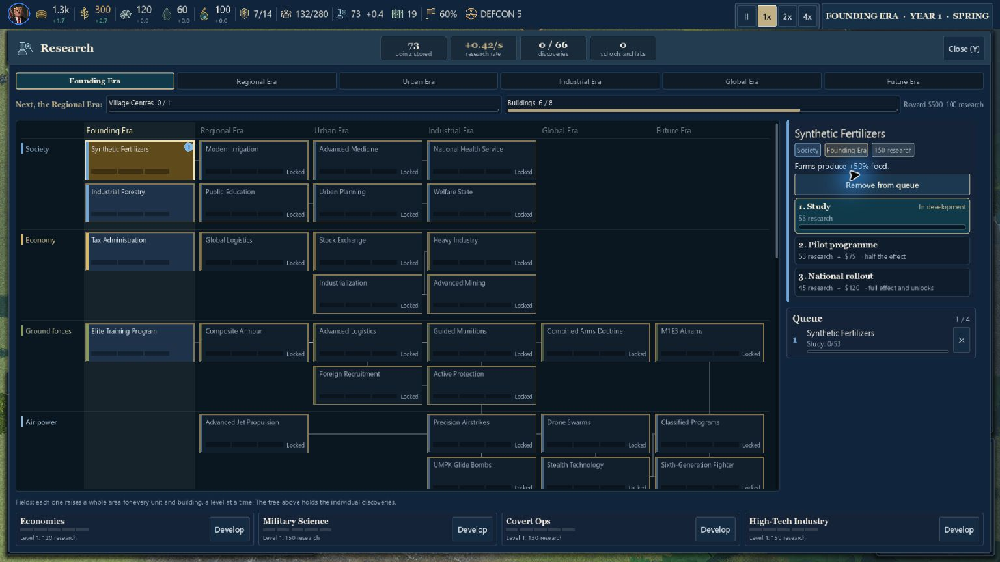
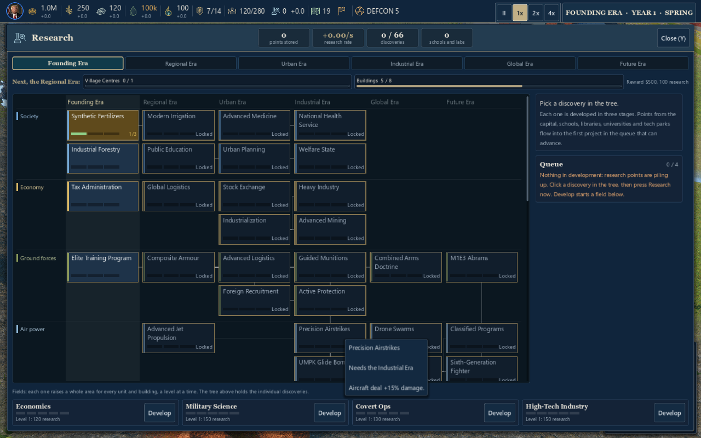
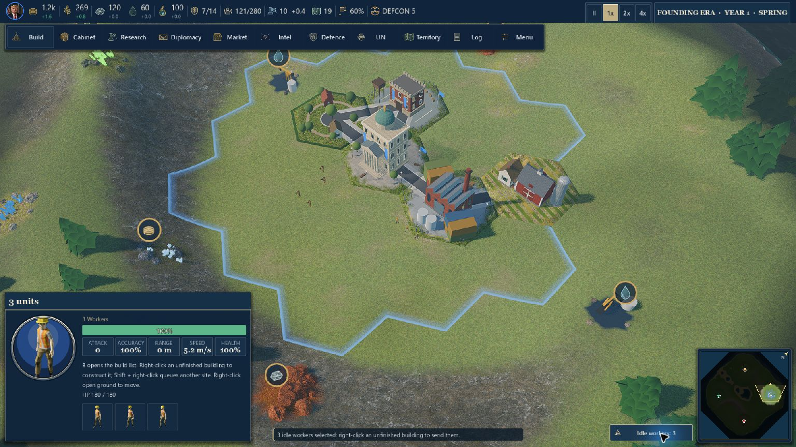
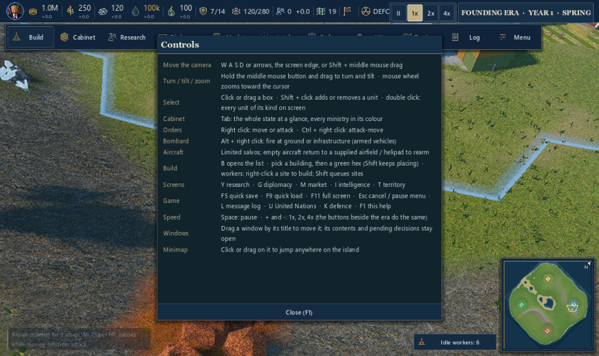
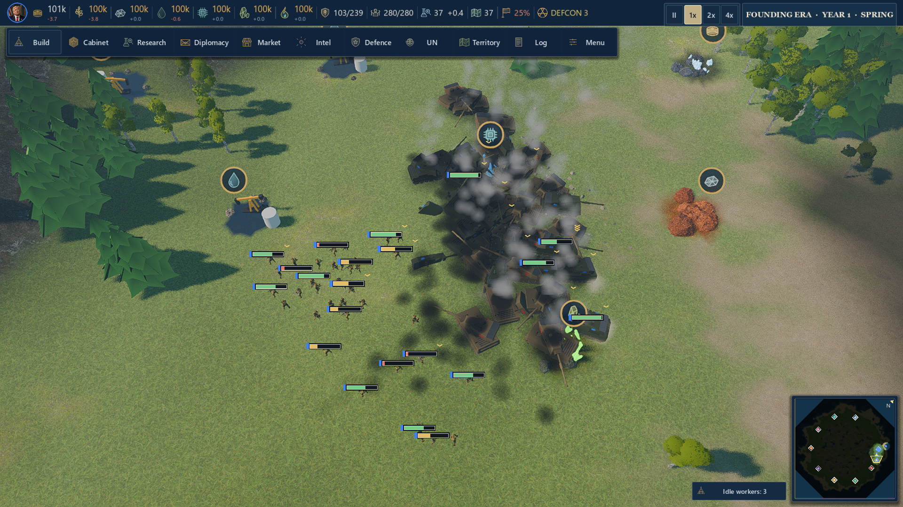
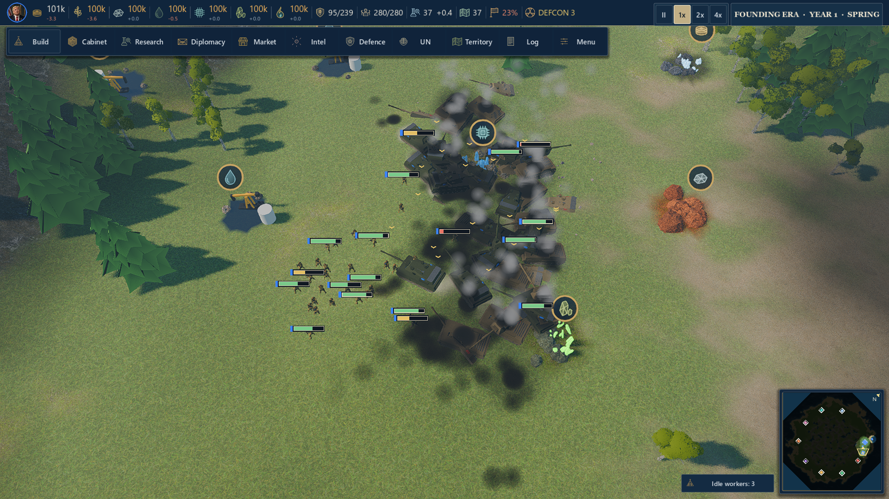

# DOMINION — סבב לקוח לא מרוצה 4 · 0.9.83

תאריך: 9 באוקטובר 2026. בסיס: קוד 0.9.82, commit `da37542`, כולל השיפורים מהסבב של Claude. המוצר שנבדק הוא משחק Windows של Godot. לא בוצעה פריסה של פרויקט הדפדפן.

## מה נעשה בפועל

שיחקתי דרך חלון המשחק, עם עכבר ומקלדת באמצעות כלי Computer Use. ב־0.9.82 פתחתי קמפיין ארצות הברית מול שלוש מדינות באי, בחרתי עובדים, נתתי פקודות תנועה, הצבתי חווה והמתנתי להשלמתה, פתחתי מחקר והתחלתי פרויקט, יצרתי קשר דיפלומטי עם סין, המתנתי לתשובה, קיבלתי הצעת נגד להסכם מסחר ושילמתי את הוויתור הנדרש. הקמפיין הגיע לשנה השנייה. בדקתי גם את פתיחת 0.9.83 הארוז, תחילת קמפיין ובחירת קבוצת עובדים דרך הכפתור שעל המסך.

בנוסף נכתבו **100 תרחישים אוטומטיים חדשים**, המפעילים את מטפלי הקלט והפקדים האמיתיים במנוע. הם עברו הן במצב headless והן בחלון גרפי עם Vulkan. אלה תרחישים מבוקרים, עם יחידות ומשאבים שהבדיקה מכינה; הם אינם 100 שחקנים עצמאיים ואינם 100 קמפיינים מלאים. הבדיקה החדשה אינה כותבת העדפות או שמירות של השחקן.

ה־100 משלימים את המשחק הידני בעיקר במצבי קצה: בחירה כפולה, יחידות נסתרות, מסכים קצרים, השתקה, מחקר חסום, המשך משחק אחרי סיום וחיפוש ללא תוצאות. נבדקו בנפרד גם התנהגות קרב מתוך קובץ ההפעלה הארוז וביצועים במפה גדולה.

## מה תוקן ושופר

| הבעיה שהלקוח פוגש | השינוי ב־0.9.83 | אימות |
|---|---|---|
| עובדים מציגים Attack-move ו־Bombard אפורים, וגם Repair ללא צורך. זה גורם לרשימת הפקודות להיראות שבורה | פקודות שאינן מתאימות לבחירה מוסתרות. חיילים וכלים ששייכים לפקודה ממשיכים לקבל אותה; כלי פגוע מקבל Repair פעיל | בדיקות 1–14, משחק ידני וצילום קבוצת עובדים |
| ההסבר לעובדים לא מסביר את כל רצף הבנייה | ההוראה מציינת B לפתיחת קטלוג, קליק ימני על אתר לא גמור ו־Shift לתור אתרים | 4, 6 וצילום |
| Shift-click מוסיף יחידה אך לא מסיר אותה, בניגוד לציפייה המקובלת | קליק עם Shift מחליף את מצב הבחירה של היחידה, ומשמר את יתר הקבוצה | 15–22 |
| גרירה ובחירה כפולה יכולות לכלול יחידות מוסתרות או שנמצאות בתוך מוביל | מסנני הבחירה והפגיעה הראשונית מתעלמים מיחידות נסתרות ומאוחסנות; בחירה חדשה מנקה גם בחירה ישנה שהוסתרה | 23–28 |
| ספינה ניתנת ללחיצה לאורך הגוף, אך תג המידע מופיע רק סמוך למרכז | ריחוף משתמש באותו חישוב גוף ובאותו מרווח כמו לחיצה. יחידה מתה, מאוחסנת או מוסתרת אינה חושפת תג | 29–40; מדידת עלות עם 200 יחידות |
| חלון F1 יכול לגדול מעבר למסך קצר; ההסבר על גרירת מצלמה לא תואם להתנהגות | חלון בגודל מוגבל עם אזור תוכן נגלל וכפתור סגירה קבוע. ההוראות עודכנו ל־Shift + middle לפאן, Shift-click להסרה, B ו־F11 | 41–52, ארבעה גדלי חלון בשני קני מידה |
| מחוון שמע יכול להציג עוצמה למרות שהערוץ מושתק; Master ב־0 נשמר/נטען באופן לא עקבי | קריאת עוצמה מכבדת Mute. שמירה וטעינה של Master משתמשות באותו מנגנון כמו שאר הערוצים | 53–68 |
| Defaults לא מחזיר את גודל הממשק לברירת המחדל | משוחזרים גם קנה המידה 80% ופריסת הממשק | 69–74 |
| שמות המחקר קטנים מדי או נחתכים; הפרויקט הראשון בתור מסומן כפעיל גם כשאחר מתקדם במקומו | שמות ב־14 במקום 12, מצבים ב־12 במקום 10. עטיפה לשתי שורות, קיצור מבוקר ושם מלא בריחוף. הסימון הפעיל נקבע לפי הפרויקט שבאמת יכול להתקדם | 75–84; כל 66 השמות נבדקים בשלושה רוחבי כרטיס |
| בהקמת הקמפיין “1 · North-east (your town)” עדיין נחתך בתוך הבורר | הוסר הסיומת המיותרת מהבורר הקבוע; ההסבר על הבירה המוכנה נשאר בריחוף | זוהה במשחק הארוז; תיקון טקסט נקודתי |
| Start-Game מפעיל 0.9.81, אף שיש קובץ ממוספר ומתקין של 0.9.82 | נבנו מחדש **שני הקבצים הראשיים** בגרסה 0.9.83. נוסף שער שחרור שבודק את גרסת המקור, הגדרות הייצוא, קובץ המשחק והמתקין | `native/verify-release.ps1`, מאפייני Windows, גרסה בתפריט ובדיקת הקובץ הארוז |
| שרידי כלי רכב נשארים לעד ומצטברים לערימות שמסתירות יחידות חיות | אחרי שלב המוות הראשוני נשמרים עד 3 שרידים ותיקים בכל אזור של 24 מטר ועד 48 במפה. עודפים שוקעים בהדרגה, וכל שריד פג אחרי 90 שניות. יחידות חיות ומנגנוני נפילה של מטוסים וספינות אינם נכללים בניקוי | 11 בדיקות ייעודיות וקרב גרפי חי. זהו שיפור בקריאות השדה ובצבירת מודלים; לא נמדד שיפור FPS משמעותי |

לא שונה עיצוב דיוקן המנהיג מהתיקון הקודם. נבדקו מחדש 57 מקרי הדיוקן כדי להגן עליו מפני נסיגה.

## צילומים

לפני: מסך המחקר במשחק 0.9.82 ששוחק ידנית.

אחרי: המחקר בתרחיש הגרפי ב־0.9.83. זהו מצב בדיקה מבוקר; התור כאן ריק.

אחרי: קבוצת עובדים במשחק Windows הארוז, בלי פקודות קרב שאינן זמינות לה.

אחרי: חלון העזרה בחלון קצר של 1008×600 ובממשק 100%. כל ההוראות והסגירה נשארים בתוך המסך.

## מחקר והשוואה למשחקים אחרים

ההשוואות הן ניתוח של ביקורות ומאמרי פיתוח שקראתי ב־9 באוקטובר 2026, לצד מה שנצפה ב־DOMINION. לא שיחקתי במשחקי ההשוואה כחלק מהסבב הזה. הביקורות מתארות את גרסאות המשחקים בזמן פרסומן.

| מקור | מה למדתי ממנו | המשמעות ל־DOMINION |
|---|---|---|
| [Creative Assembly: תהליך UX של Total War Saga: Troy](https://www.gamedeveloper.com/production/deep-dive-evolving-the-ux-ui-of-i-a-total-war-saga-troy-i-using-player-feedback) — מאמר מפי מעצב הממשק | בדיקות הראו ששחקנים מתקשים לזהות פעולה מרכזית; הצוות שינה סמל והפריד בין התראות לסיום תור | פעולה חשובה צריכה להיות קלה לזיהוי. הוראות הבנייה ופקודות תלויות בחירה שופרו. Troy מבוסס תורות, ולכן לא הועתקה ממנו מכניקת סיום תור |
| [PC Gamer: Old World review](https://www.pcgamer.com/old-world-review/) | המבקר נהנה מהעומק אך תיאר תפריטים שקשה להבין ומידע חיוני שקשה למצוא | עומק מערכתי לא מפצה על ניווט מעייף. המחקר צריך להראות מה מתקדם ומה חסום, בלי לנחש מתוך התור |
| [PC Gamer: Civilization VII review](https://www.pcgamer.com/games/strategy/civilization-7-review/) — 3 בפברואר 2025 | הביקורת מתארת יותר מדי לחיצות כדי להגיע למידע, לצד תחושת דיפלומטיה פחות אישית | זו נקודת השוואה לחיכוך ולתחושת “טופס”: ב־DOMINION תהליך הקשר והצעת הנגד עבד בפועל, אבל שיחת מנהיגים עדיין נשענת בעיקר על טקסט ותמונה |
| [Swords & Soldiers: מחקר שימושיות](https://www.gamedeveloper.com/design/successful-playtesting-in-i-swords-soldiers-i-) — מפי החוקר | צפייה במשתמשים גילתה בעיות בזיהוי סמלים, בהסברים ובטקסטי ריחוף שחסמו מידע | בדיקה של כפתור בקוד לבדה אינה מספיקה; לכן שוחק משחק אמיתי ונבדקו הצילומים. מספר תרחישי האוטומציה אינו תחליף למשתמשים עצמאיים |
| [A Survey of Video Game Testing, 2021](https://arxiv.org/abs/2103.06431) | הסקירה מתארת את התפקיד המרכזי של בדיקות ידניות ואת הקושי להכליל אוטומציה בין משחקים | שולבו משחק חופשי, בדיקות גבול ותסריטי רגרסיה; אין כאן הוכחה לכל מצב אפשרי במשחק |
| [Game Accessibility Guidelines — גודל טקסט](https://gameaccessibilityguidelines.com/use-an-easily-readable-default-font-size/) ו[ניגודיות](https://gameaccessibilityguidelines.com/provide-high-contrast-between-text-ui-and-background/) | טקסט קטן וטקסט שנבלע ברקע פוגעים ביכולת לקרוא ולהבין | הוגדלו שמות ומצבים במחקר ונשמרה התאמת חלונות לקנה המידה. 14 יחידות ממשק אינן אישור נגישות; המלצות צפייה מטלוויזיה אינן שקולות למסך מחשב |

## מה עדיין מעצבן ודורש עבודה

- **אחידות גרפית:** בתפריט הראשי יש איור עשיר, בעוד שהעולם משלב עצים פשוטים, אנשים זעירים ובנייני עיר מפורטים יותר. במבט רחוק קשה לזהות יחידה לפי דגם בלבד. תגי הריחוף שופרו; דגמי העולם והאנימציות לא הוחלפו בסבב הזה.
- **רעש בתמונה:** לקרקע יש דוגמה צפופה, ולמשאבים סמלים גדולים. בצילומי המשחק הם מתחרים על תשומת לב עם יחידות קטנות. אין כאן טענה שהוחלפו חומרי הקרקע או כל הסמלים.
- **תחושת דיפלומטיה:** השיחה, ההמתנה והצעת הנגד פועלות, אבל רוב התגובה מגיעה מטקסט. לא נוספו דיבוב או אנימציות מנהיגים.
- **קצב והכוונה:** בתחילת משחק יש הרבה משרדים ומעט פעולות מעשיות מיידיות. ההוראות לעובדים ברורות יותר, אבל לא בוצע איזון מלא של כל עידן או מדינה.
- **שמע:** נבדקו השתקה, חזרה מעוצמה אפס, ערוצי שמע וברירות מחדל. לא נערכה הערכת האזנה עצמאית עם משתתפים. אין פסקול קרב חדש; המוזיקה עדיין מבוססת על הנושא הקיים.
- **מקרי קצה שדורשים משחק ארוך:** לא הושלמו ידנית בסבב הזה כל המדינות, כל המפות או הקמה של עיר רביעית בכל תצורה. בדיקות ההמשך אחרי ניצחון והפסד עברו, כולל סבב הרגרסיה הייעודי.
- **Steam:** לא בוצעו העלאה ל־Steam או בדיקות Steam Deck, בקר, הישגים, Cloud, ריבוי שחקנים או חתימה דיגיטלית. אלה אינם מסומנים כ“עבר”.

## אימות נוסף

| סדרה | תוצאה |
|---|---:|
| 100 התרחישים החדשים, headless וחלון Vulkan | 100/100 בכל הרצה מלאה |
| סבב לקוח 3 — רגרסיה | 100/100 |
| תפריטים | 52/52 |
| מחקר | 101/101 |
| המשך אחרי ניצחון/הפסד, כולל שמירות ישנות | 30/30 |
| שמירת קמפיינים והתאוששות מכשל אחסון | 4/4 |
| מסגרת ודיוקן מנהיג | 57/57 |
| מסך מלא, שינוי גודל ו־F11 | 15/15 |
| מנגנוני נשק מתוך קובץ Windows הארוז | COMBAT_TEST PASS |
| תקציב שרידים, גיל, ניקוי הדרגתי והגנה על יחידות חיות | 11/11 |

ברגרסיית סבב 3 נדרשה הרצה מחוץ לארגז החול כדי ליצור ולמחוק את קובץ הבדיקה הזמני תחת נתוני המשחק. ההרצה הראשונית נעצרה בחוסר גישה; ההרצה עם הגישה הנדרשת עברה 100/100.

החישוב החדש של ריחוף נמדד עם 200 יחידות ו־100 דגימות: **3.830 מילישניות לדגימה** במצב headless במחשב הבדיקה, לאחר חימום מטמון גבולות המודלים. הממשק דוגם ריחוף פעם ב־0.12 שנייה. זה אינו מדד FPS ואינו הבטחה לביצועים בחומרה אחרת.

### בדיקת ביצועים

הבדיקה נערכה ב־Vulkan Forward+ על Intel Iris Xe, באיכות Balanced ובצילום 1920×1080. נמדדו 12 תנאים: **9 עברו ו־3 חרגו מהתקציב**. הנתונים הם ממחשב יחיד ומתרחיש עומס מבוקר, ואינם מדגם חומרה או הבטחה למחשב אחר.

| מדד | תוצאה בהרצה האחרונה | מצב |
|---|---:|---|
| טעינת האי | 10.8 שניות | במסגרת תקציב 15 שניות |
| טעינת Pangaea עם תשע מדינות | 30.8 שניות | במסגרת תקציב 45 שניות |
| זיכרון סטטי לאחר הטעינה | 372 MB | במסגרת התקציב |
| צעד סימולציה בשלום | ממוצע 4.8 ms, אחוזון 99: 62.4 ms | האחוזון חורג מתקציב 40 ms |
| חשיבת שמונת היריבים | 3.25 ms לצעד | מעט מעל תקציב 3 ms |
| סימולציית קרב של 200 יחידות שנוספו למפה | ממוצע 31.4 ms, אחוזון 99: 68.1 ms | במסגרת תקציב 45/130 ms |
| שמירה בזיכרון ושחזור המפה הגדולה | 17/7265 ms | במסגרת תקציב 1500/8000 ms |
| קרב חי מרונדר, לאחר הוספת תגבורת של 100 יחידות | כ־8 FPS; האחוז האיטי כ־6 FPS | נכשל בתקציב 25 FPS; בעיית ביצועים משמעותית נשארה |

ניקוי שרידים צמצם הצטברות דגמים, אבל **לא פתר את קצב הפריימים בקרב הגדול**: גם לפניו וגם אחריו התקבלו כ־8 FPS במבחן החי. אלה שתי הרצות עם שונות בתזמון הקרב, ולא מדידת A/B מבודדת. בדוח הפרופיילר בולטים חיפוש מטרות, קרב ותנועה; לא נעשה בסבב הזה שכתוב של מנגנון הסימולציה או של כל דגמי היחידות.

בהרצת העומס הופיעו גם הודעות PagedAllocator של המנוע בעת הסגירה. הן תועדו ולא הוצגו כבדיקה נקייה. היומן המלא מצורף ב־[performance.txt](review/round4/performance.txt).

צילום העומס שחשף את הערימות:

צילום הרצה לאחר הוספת הניקוי. הקרב בשני הצילומים אינו באותו רגע, וכלים חיים ושרידים חדשים נשארים בשדה:

נמצאה גם שגיאה בסקריפט הביצועים הקודם: הוא הסתיר את חלון התפריט בלי לסגור אותו, והשאיר את עץ הסצנה מושהה. המצלמה לא עברה לקרב ומדד הפריימים לא תיאר קרב חי. תוקן סקריפט הבדיקה, נוספה בדיקה שהסימולציה פעילה והמצלמה מעל שדה הקרב, ונעשתה מדידה חדשה. אין להשתמש במספר ה־FPS מההרצה הראשונית כמדד קרב.

בבדיקת הנשקים נמצא כשל בידוד נוסף: קליע מושהה מהמקרה הקודם עלול לפגוע במטרה הבאה לפני שהתוקף שלה יורה. כל מקרה מנקה כעת תחמושת שנותרה מהמקרה הקודם. זהו תיקון של בדיקת הרגרסיה, ולא שינוי בחוקי הנשק במשחק הרגיל.

בסיום הבדיקות הושוו SHA256 של autosave, quicksave, test.json ו־settings.cfg לגיבוי שנלקח בתחילת הסבב: כל ארבעת הקבצים נשארו זהים.

## שחרור

קובץ ההפעלה הראשי והמתקין נבנו מחדש ב־0.9.83. בוצעה בדיקה של גרסת Windows, גרסת תפריט המשחק והתאמה להגדרות המקור.

- משחק: `dist/DOMINION.exe` — 198,935,840 bytes.
- מתקין: `dist/DOMINION-Setup.exe` — 114,082,097 bytes.
- SHA256 משחק: `dced6649f1d7e94edb2837041ced844703a17118a00b8a8fcd0cc986af558334`.
- SHA256 מתקין: `8d6c7b786733dc68d78b775fefabce744a9a5069313034f23237a649eacf95b5`.
- נתוני השחרור נבדקים גם באמצעות `native/verify-release.ps1`.
- יעד ההורדה: GitHub Releases של מאגר המשחק; לא שרת פרויקט הדפדפן. יעד לשרת הורדות נוסף לא נמסר בזמן כתיבת הדוח.

## 100 התרחישים החדשים

התוצאות נוצרו על ידי `native/godot/tools/customer-round4-100.gd`; עותק התוצאה נשמר לצד הדוח ב־`review/round4/results.json`. שם הבדיקה נשמר באנגלית כדי לאפשר התאמה ישירה ליומן המנוע.

| # | תחום | תרחיש | תוצאה |
|---:|---|---|---|
| 1 | פקודות יחידות | An unarmed worker is not offered Attack-move | עבר |
| 2 | פקודות יחידות | An unarmed worker is not offered Bombard | עבר |
| 3 | פקודות יחידות | An unarmed worker is not offered Repair | עבר |
| 4 | פקודות יחידות | A worker explains how to begin building | עבר |
| 5 | פקודות יחידות | A worker group has no combat orders | עבר |
| 6 | פקודות יחידות | A worker group explains queued construction jobs | עבר |
| 7 | פקודות יחידות | A mixed escort group retains Attack-move | עבר |
| 8 | פקודות יחידות | An infantry escort has no unsupported Bombard | עבר |
| 9 | פקודות יחידות | Armed infantry retain Attack-move | עבר |
| 10 | פקודות יחידות | Healthy infantry are not offered vehicle repair | עבר |
| 11 | פקודות יחידות | A tank retains supported ground fire | עבר |
| 12 | פקודות יחידות | A healthy tank has no unnecessary repair order | עבר |
| 13 | פקודות יחידות | Damage makes tank repair available | עבר |
| 14 | פקודות יחידות | The displayed repair order starts a repair | עבר |
| 15 | בחירה | Plain click selects the clicked worker | עבר |
| 16 | בחירה | Shift-click removes an already selected worker | עבר |
| 17 | בחירה | Shift-click adds an unselected worker | עבר |
| 18 | בחירה | Shift-click keeps the other selected kind | עבר |
| 19 | בחירה | Removing one unit preserves its escort | עבר |
| 20 | בחירה | Plain click replaces a prior selection | עבר |
| 21 | בחירה | Drag selection still takes visible units | עבר |
| 22 | בחירה | Shift-drag adds without losing the first group | עבר |
| 23 | בחירה | Drag cannot select a hidden unit | עבר |
| 24 | בחירה | Drag cannot select a stowed unit | עבר |
| 25 | בחירה | Double-click ignores hidden units of the same kind | עבר |
| 26 | בחירה | Double-click ignores stowed units of the same kind | עבר |
| 27 | בחירה | Shift-double-click preserves a different selected kind | עבר |
| 28 | בחירה | A plain click on empty ground clears unit selection | עבר |
| 29 | זיהוי יחידות | worker is recognised at its visible centre | עבר |
| 30 | זיהוי יחידות | soldier is recognised at its visible centre | עבר |
| 31 | זיהוי יחידות | tank is recognised at its visible centre | עבר |
| 32 | זיהוי יחידות | helicopter is recognised at its visible centre | עבר |
| 33 | זיהוי יחידות | jet is recognised at its visible centre | עבר |
| 34 | זיהוי יחידות | destroyer is recognised at its visible centre | עבר |
| 35 | זיהוי יחידות | A warship is recognised away from its centre on its hull | עבר |
| 36 | זיהוי יחידות | Hiding the ship removes its hover target | עבר |
| 37 | זיהוי יחידות | Stowed craft expose no hover tag | עבר |
| 38 | זיהוי יחידות | Destroyed craft expose no live hover tag | עבר |
| 39 | זיהוי יחידות | A live tag identifies ownership and health | עבר |
| 40 | זיהוי יחידות | Empty space outside the viewport names no unit | עבר |
| 41 | עזרה ומסכים | Help and Close fit 1280x800 at 80% | עבר |
| 42 | עזרה ומסכים | Help and Close fit 1280x800 at 100% | עבר |
| 43 | עזרה ומסכים | Help and Close fit 1008x600 at 80% | עבר |
| 44 | עזרה ומסכים | Help and Close fit 1008x600 at 100% | עבר |
| 45 | עזרה ומסכים | Help and Close fit 1280x720 at 80% | עבר |
| 46 | עזרה ומסכים | Help and Close fit 1280x720 at 100% | עבר |
| 47 | עזרה ומסכים | Help and Close fit 1600x900 at 80% | עבר |
| 48 | עזרה ומסכים | Help and Close fit 1600x900 at 100% | עבר |
| 49 | עזרה ומסכים | Short-window help reaches its final instructions by scrolling or fitting | עבר |
| 50 | עזרה ומסכים | Help agrees with camera panning and selection controls | עבר |
| 51 | עזרה ומסכים | Help includes fullscreen and the build shortcut | עבר |
| 52 | עזרה ומסכים | Close remains usable after scrolling to the bottom | עבר |
| 53 | שמע | Master zero really mutes and reads zero | עבר |
| 54 | שמע | Master restores an audible intermediate level | עבר |
| 55 | שמע | Master restores its designed full level | עבר |
| 56 | שמע | Master reports mute even if stored gain is nonzero | עבר |
| 57 | שמע | SFX zero really mutes and reads zero | עבר |
| 58 | שמע | SFX restores an audible intermediate level | עבר |
| 59 | שמע | SFX restores its designed full level | עבר |
| 60 | שמע | SFX reports mute even if stored gain is nonzero | עבר |
| 61 | שמע | Music zero really mutes and reads zero | עבר |
| 62 | שמע | Music restores an audible intermediate level | עבר |
| 63 | שמע | Music restores its designed full level | עבר |
| 64 | שמע | Music reports mute even if stored gain is nonzero | עבר |
| 65 | שמע | Interface zero really mutes and reads zero | עבר |
| 66 | שמע | Interface restores an audible intermediate level | עבר |
| 67 | שמע | Interface restores its designed full level | עבר |
| 68 | שמע | Interface reports mute even if stored gain is nonzero | עבר |
| 69 | ברירות מחדל | Defaults restores the interface size immediately | עבר |
| 70 | ברירות מחדל | Defaults restores Balanced quality | עבר |
| 71 | ברירות מחדל | Defaults restores camera controls | עבר |
| 72 | ברירות מחדל | Defaults restores frame counter and limit | עבר |
| 73 | ברירות מחדל | Defaults restores the disclosed autosave interval | עבר |
| 74 | ברירות מחדל | Defaults unmutes every audio bus | עבר |
| 75 | מחקר | Tree highlights an available first project | עבר |
| 76 | מחקר | Tree highlights the next project while the first waits for funding | עבר |
| 77 | מחקר | Blocked first project says Waiting | עבר |
| 78 | מחקר | Funding resumes and highlights the waiting first project | עבר |
| 79 | מחקר | Empty queue highlights no active project | עבר |
| 80 | מחקר | Tree labels meet the increased readable font sizes | עבר |
| 81 | מחקר | All discovery titles fit two lines at card width 134 | עבר |
| 82 | מחקר | All discovery titles fit two lines at card width 176 | עבר |
| 83 | מחקר | All discovery titles fit two lines at card width 210 | עבר |
| 84 | מחקר | Full discovery name remains available in its tooltip | עבר |
| 85 | משרדי המדינה | diplomacy opens with content inside the viewport | עבר |
| 86 | משרדי המדינה | market opens with content inside the viewport | עבר |
| 87 | משרדי המדינה | intel opens with content inside the viewport | עבר |
| 88 | משרדי המדינה | territory opens with content inside the viewport | עבר |
| 89 | משרדי המדינה | defence opens with content inside the viewport | עבר |
| 90 | משרדי המדינה | un opens with content inside the viewport | עבר |
| 91 | בנייה | A failed search explains that nothing matches | עבר |
| 92 | בנייה | Clear search restores the build catalog immediately | עבר |
| 93 | בנייה | Economy contains actual production choices | עבר |
| 94 | בנייה | Civic & research contains actual production choices | עבר |
| 95 | בנייה | Military contains actual production choices | עבר |
| 96 | בנייה | A production choice begins live placement | עבר |
| 97 | המשך משחק | victory initially stops the match with a result | עבר |
| 98 | המשך משחק | victory continuation restores normal campaign input | עבר |
| 99 | המשך משחק | defeat initially stops the match with a result | עבר |
| 100 | המשך משחק | defeat continuation restores normal campaign input | עבר |
